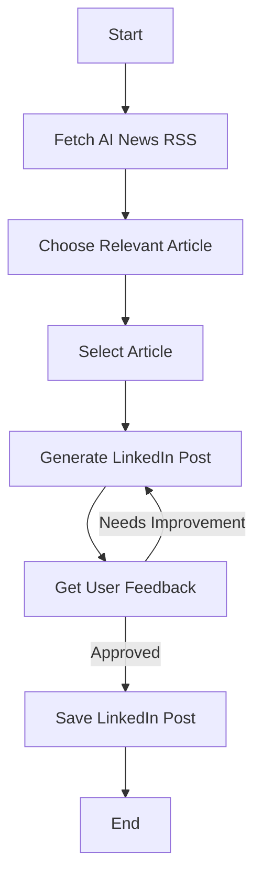

# AI News Workflow

A LangGraph-based workflow that automatically finds the latest AI news, selects the most relevant article, and generates a LinkedIn post about them.

## Overview

This project automates the process of sharing high-quality AI news content on LinkedIn. The workflow consists of several steps:

1. **Search the web** for the latest AI news articles
2. **Select a relevant article** based on predefined criteria:
   - Scientific breakthroughs in AI
   - Technical innovations in manufacturing, computer vision, robotics, and aerospace
   - Recent publication (within the last 4 weeks)
3. **Generate a LinkedIn post** about the selected article
4. **Get user feedback** on the generated post
5. **Improve the post** if needed based on feedback
6. **Save the final post** to a file

## Workflow Visualization

The workflow is implemented using LangGraph and follows this structure:



## Requirements

- Python 3.8+
- LangChain and LangGraph libraries
- Tavily API key (for web search)
- Either a local LLM (via Ollama) or OpenAI API key

## Installation

1. Install the required dependencies:
```bash
uv sync
```

2. Set up environment variables in a `.env` file:

```
# Choose model type: "local" or "openai"
MODEL=local

# If using OpenAI, add your API key
OPENAI_API_KEY=sk-your-openai-api-key

# Required for web search
TAVILY_API_KEY=tvly-your-tavily-api-key
```

## Usage

Run the workflow:

```bash
uv run python src/main.py
```

The generated LinkedIn post will be saved to `linkedin_post.txt` in the project root directory.

## License

This project is licensed under the MIT License - see the [LICENSE](LICENSE) file for details.

> For inquiries, feel free to contact me via [email](mailto:juliushaas91@gmail.com) or [LinkedIn](https://www.linkedin.com/in/jh91/) 
